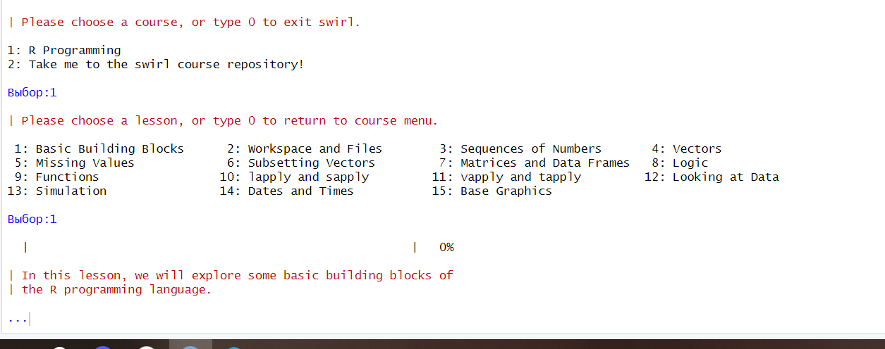
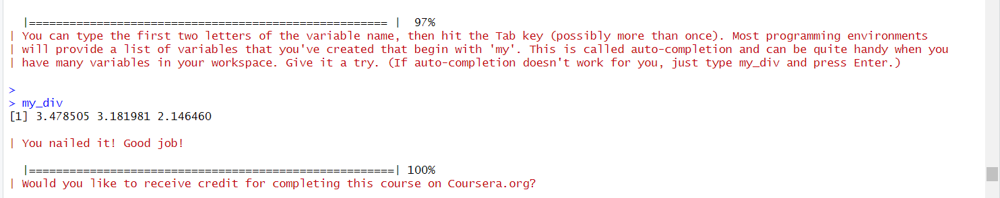
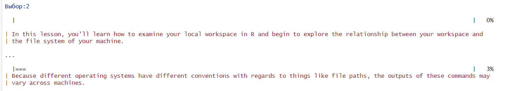
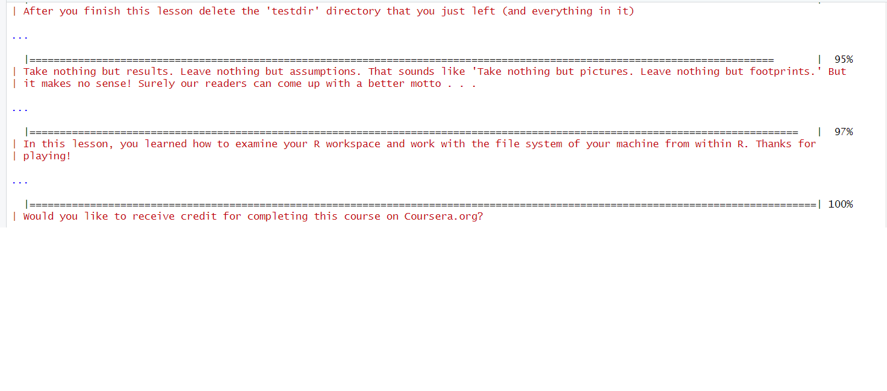
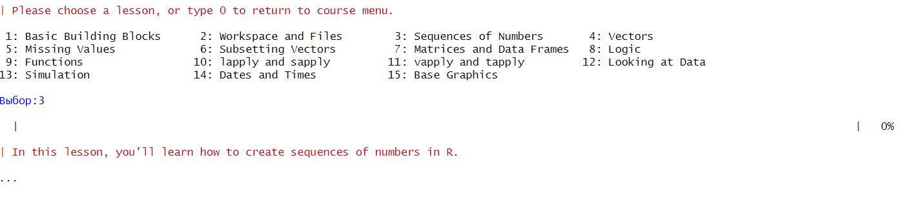
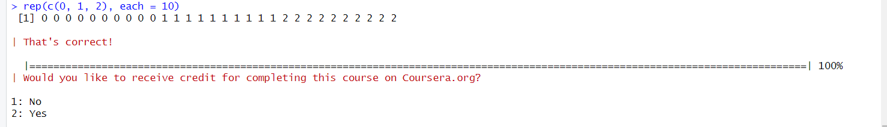
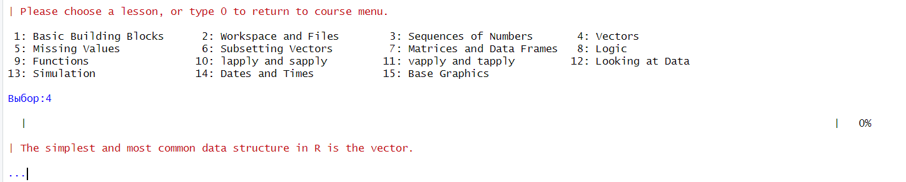
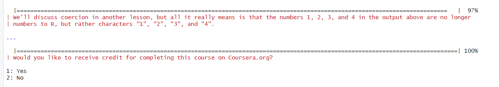

Практическая работа 1
================

## Цель работы

1.  Познакомиться с языком R
2.  Пройти обучающие уроки в swirl

## Исходные данные

1.  ОС Windows
2.  Библиотека swirl
3.  RStudio

## План

1.  Скачать R и RStudio
2.  Подключить swirl
3.  Пройти первые 4 учебных задания
4.  Создать отчет

## Описание шагов:

1.  *Воспользуемся RStudio*

2.  *Заходим в Packages и устанавливаем swirl*

3.  *Проходим первый урок: Basic Building Blocks*

    Начало первого урока:  
    

    In its simplest form, R can be used as an interactive calculator.
    Type 5 + 7 and press Enter

``` r
5+7
```

    [1] 12

    | Type x <- 5 + 7. It's important to include a single space on each side of the assignment operator, but do NOT put a space between the
    | `<` and the `-` that form the arrow.

``` r
x<-5+7
```

    | Type y <- x - 3 and press Enter. Whether you use x - 3 or x-3 is personal preference, but it's good habit to include a space on either
    | side of the assignment operator.

``` r
y<- x-3
```

    | The easiest way to create a vector is with the c() function, which stands for 'concatenate' or 'combine'. To create a vector containing
    | the numbers 1.1, 9, and 3.14, type c(1.1, 9, 3.14). Try it now and store the result in a variable called z.

``` r
z<- c(1.1,9,3.14)
```

    | Anytime you have questions about a particular function, you can access R's built-in help files via the `?` command. For example, if you
    | want more information on the c() function, type ?c without the parentheses that normally follow a function name. Give it a try.

``` r
?c
```

    запускаю httpd сервер помощи... готово

    | You can combine vectors to make a new vector. Create a new vector that contains z, 555, then z again in that order. Don't assign this
    | vector to a new variable, so that we can just see the result immediately.

``` r
c(z,555,z)
```

    [1]   1.10   9.00   3.14 555.00   1.10   9.00   3.14

    | Numeric vectors can be used in arithmetic expressions. Type the following to see what happens: z * 2 + 100

``` r
z*2+100
```

    [1] 102.20 118.00 106.28

    | Take the square root of z - 1 and assign it to a new variable called my_sqrt.

``` r
my_sqrt<-sqrt(z-1)
```

    | Assign the result of sqrt(z - 1) to a variable called my_sqrt.

``` r
my_sqrt<-sqrt(z-1)
```

    | Before we view the contents of the my_sqrt variable, what do you think it contains?

    1: a vector of length 3
    2: a single number (i.e a vector of length 1)
    3: a vector of length 0 (i.e. an empty vector)

    Выбор:1

    | Now, create a new variable called my_div that gets the value of z divided by my_sqrt.

``` r
my_div<-z/my_sqrt
```

    | Which statement do you think is true?

    1: my_div is undefined
    2: my_div is a single number (i.e a vector of length 1)
    3: The first element of my_div is equal to the first element of z divided by the first element of my_sqrt, and so on...

    Выбор:3

    | Keep up the great work!

    | To see another example of how this vector 'recycling' works, try adding c(1, 2, 3, 4) and c(0, 10). Don't worry about saving the result
    | in a new variable.

``` r
c(1,2,3,4)+c(0,10)
```

    [1]  1 12  3 14

    | Try c(1, 2, 3, 4) + c(0, 10, 100) for an example

``` r
c(1, 2, 3, 4) + c(0, 10, 100)
```

    Warning in c(1, 2, 3, 4) + c(0, 10, 100): длина большего объекта не является
    произведением длины меньшего объекта

    [1]   1  12 103   4

    | Type c(1, 2, 3, 4) + c(0, 10, 100) to see how R handles adding two vectors, when the shorter vector's length does not divide evenly into
    | the longer vector's length. Don't worry about assigning the result to a variable.

    > c(1, 2, 3, 4) + c(0, 10, 100)
    [1]   1  12 103   4
    Warning message:
    In c(1, 2, 3, 4) + c(0, 10, 100) :
      longer object length is not a multiple of shorter object length

    | Keep up the great work!

    | In many programming environments, the up arrow will cycle through previous commands. Try hitting the up arrow on your keyboard until you
    | get to this command (z * 2 + 100), then change 100 to 1000 and hit Enter. If the up arrow doesn't work for you, just type the corrected
    | command.

``` r
z*2+1000
```

    [1] 1002.20 1018.00 1006.28

    | You can type the first two letters of the variable name, then hit the Tab key (possibly more than once). Most programming environments
    | will provide a list of variables that you've created that begin with 'my'. This is called auto-completion and can be quite handy when you
    | have many variables in your workspace. Give it a try. (If auto-completion doesn't work for you, just type my_div and press Enter.)

    > 
    > my_div
    [1] 3.478505 3.181981 2.146460

    | You nailed it! Good job!

      |======================================================| 100%
    | Would you like to receive credit for completing this course on Coursera.org?

Сообщение о выполнении первого курса



Конец первого урока

1.  *Начало второго курса*



    Access information about the file "mytest.R" by using
    | file.info().

file.info(“mytest.R”)

    | Determine which directory your R session is using as its current working directory using getwd().

getwd()

    [1] "C:/PracZahar/Zahar"

    | Now take a look at objects that are in your workspace using ls().

ls()

    [1] "my_div"  "my_sqrt" "v"       "x"       "y"       "z"

    Assign 9 to x using x <- 9.

``` r
x<-9
```

    | Now take a look at objects that are in your workspace using ls().

ls

     List all the files in your working directory using list.files() or dir().

dir()

    "_quarto.yml" "about.qmd"   "docs"        "index.qmd"   "styles.css"  "Zahar.Rproj"

    | As we go through this lesson, you should be examining the help page for each new function. Check out the help page for list.files with
    | the command ?list.files.

?list.files  
args(list.files)

    function (path = ".", pattern = NULL, all.files = FALSE, full.names = FALSE, 
        recursive = FALSE, ignore.case = FALSE, include.dirs = FALSE, 
        no.. = FALSE) 
    NULL

    | Assign the value of the current working directory to a variable called "old.dir".

old.dir \<- getwd()

    | Use dir.create() to create a directory in the current working directory called "testdir".

dir.create(“testdir”)

     Set your working directory to "testdir" with the setwd() command.

setwd(“testdir”)

    | Create a file in your working directory called "mytest.R" using the file.create() function.

file.create(“mytest.R”)

    [1] TRUE

    | This should be the only file in this newly created directory. Let's check this by listing all the files in the current directory.

list.files()

    Use file.exists("mytest.R") to check that a file exists.

file.exists(“mytest.R”)

    [1] FALSE

    Access information about the file "mytest.R" by using
    | file.info()

file.info(“mytest.R”)

    | Nice work!

    | You can use the $ operator --- e.g., file.info("mytest.R")$mode
    | --- to grab specific items

    Change the name of the file "mytest.R" to "mytest2.R" by using file.rename()

file.rename(“mytest.R”, “mytest2.R”)

    | Make a copy of "mytest2.R" called "mytest3.R" using file.copy().

file.copy(“mytest2.R”,“mytest3.R”)

    | Provide the relative path to the file "mytest3.R" by using file.path().

file.path(“mytest3.R”)

    You can use file.path to construct file and directory paths that are independent of the operating system your R code is running on. Pass
    | 'folder1' and 'folder2' as arguments to file.path to make a platform-independent pathname.

file.path(“folder1”, “folder2”)

    | ?dir.create will show you the docs.

    > ?dir.create

    | Create a directory in the current working directory called "testdir2" and a subdirectory for it called "testdir3", all in one command by
    | using dir.create() and file.path().

dir.create(file.path(‘testdir2’, ‘testdir3’), recursive = TRUE)

    | Go back to your original working directory using setwd(). (Recall that we created the variable old.dir with the full path for the orginal
    | working directory at the start of these questions.)

setwd(old.dir)

Сообщение об окончании второго курса:



1.  *Третий курс: Sequences of Numbers*



    | The simplest way to create a sequence of numbers in R is by using the `:` operator. Type 1:20 to see how it works.

``` r
1:20
```

     [1]  1  2  3  4  5  6  7  8  9 10 11 12 13 14 15 16 17 18 19 20

    | That gave us every integer between (and including) 1 and 20. We could also use it to create a sequence of real numbers. For example, try
    | pi:10.

``` r
pi:10
```

    [1] 3.141593 4.141593 5.141593 6.141593 7.141593 8.141593 9.141593

    | What happens if we do 15:1? Give it a try to find out

``` r
15:1
```

     [1] 15 14 13 12 11 10  9  8  7  6  5  4  3  2  1

    | Pull up the documentation for `:` now.

    ?':'

    The most basic use of seq() does exactly the same thing as the `:` operator. Try seq(1, 20) to see this.

``` r
seq(1, 20)
```

     [1]  1  2  3  4  5  6  7  8  9 10 11 12 13 14 15 16 17 18 19 20

    | This gives us the same output as 1:20. However, let's say that instead we want a vector of numbers ranging from 0 to 10, incremented by
    | 0.5. seq(0, 10, by=0.5) does just that. Try it out.

``` r
seq(0, 10, by=0.5)
```

     [1]  0.0  0.5  1.0  1.5  2.0  2.5  3.0  3.5  4.0  4.5  5.0  5.5  6.0  6.5  7.0
    [16]  7.5  8.0  8.5  9.0  9.5 10.0

    | Or maybe we don't care what the increment is and we just want a sequence of 30 numbers between 5 and 10. seq(5, 10, length=30) does the
    | trick. Give it a shot now and store the result in a new variable called my_seq.

``` r
my_seq <- seq(5, 10, length=30)
```

    | To confirm that my_seq has length 30, we can use the length() function. Try it now.

``` r
length(my_seq)
```

    [1] 30

    | There are several ways we could do this. One possibility is to combine the `:` operator and the length() function like this:
    | 1:length(my_seq). Give that a try.

``` r
1:length(my_seq)
```

     [1]  1  2  3  4  5  6  7  8  9 10 11 12 13 14 15 16 17 18 19 20 21 22 23 24 25
    [26] 26 27 28 29 30

``` r
seq(along.with = my_seq)
```

     [1]  1  2  3  4  5  6  7  8  9 10 11 12 13 14 15 16 17 18 19 20 21 22 23 24 25
    [26] 26 27 28 29 30

    | However, as is the case with many common tasks, R has a separate built-in function for this purpose called seq_along(). Type
    | seq_along(my_seq) to see it in action.

``` r
seq_along(my_seq)
```

     [1]  1  2  3  4  5  6  7  8  9 10 11 12 13 14 15 16 17 18 19 20 21 22 23 24 25
    [26] 26 27 28 29 30

    | If we're interested in creating a vector that contains 40 zeros, we can use rep(0, times = 40). Try it out.

``` r
rep(0, times = 40)
```

     [1] 0 0 0 0 0 0 0 0 0 0 0 0 0 0 0 0 0 0 0 0 0 0 0 0 0 0 0 0 0 0 0 0 0 0 0 0 0 0
    [39] 0 0

    | If instead we want our vector to contain 10 repetitions of the vector (0, 1, 2), we can do rep(c(0, 1, 2), times = 10). Go ahead.

``` r
rep(c(0, 1, 2), times = 10)
```

     [1] 0 1 2 0 1 2 0 1 2 0 1 2 0 1 2 0 1 2 0 1 2 0 1 2 0 1 2 0 1 2

    | Finally, let's say that rather than repeating the vector (0, 1, 2) over and over again, we want our vector to contain 10 zeros, then 10
    | ones, then 10 twos. We can do this with the `each` argument. Try rep(c(0, 1, 2), each = 10).

``` r
rep(c(0, 1, 2), each = 10)
```

     [1] 0 0 0 0 0 0 0 0 0 0 1 1 1 1 1 1 1 1 1 1 2 2 2 2 2 2 2 2 2 2

Сообщение о выполнении 3 курса



1.  *Четверый курс: Vectors*

    

    First, create a numeric vector num_vect that contains the values
    0.5, 55, -10, and 6.

``` r
num_vect<-c(0.5,55,-10,6)
```

    | Now, create a variable called tf that gets the result of num_vect < 1, which is read as 'num_vect is less than 1'.

``` r
tf <- num_vect < 1
```

    | What do you think tf will look like?

    1: a vector of 4 logical values
    2: a single logical value
    (1)

``` r
tf
```

    [1]  TRUE FALSE  TRUE FALSE

    | Let's try another. Type num_vect >= 6 without assigning the result to a new variable

``` r
num_vect >= 6
```

    [1] FALSE  TRUE FALSE  TRUE

    | (3 > 5) & (4 == 4)

    1: TRUE
    2: FALSE

    Выбор:2

    | (TRUE == TRUE) | (TRUE == FALSE)

    1: FALSE
    2: TRUE

    Выбор:2

    | ((111 >= 111) | !(TRUE)) & ((4 + 1) == 5)

    1: TRUE
    2: FALSE

    Выбор:1

    | Create a character vector that contains the following words: "My", "name", "is". Remember to enclose each word in its own set of double
    | quotes, so that R knows they are character strings. Store the vector in a variable called my_char.

``` r
my_char<-c("My","name","is")
```

``` r
my_char
```

    [1] "My"   "name" "is"  

     Type paste(my_char, collapse = " ") now. Make sure there's a space between the double quotes in the `collapse` argument. You'll see why
    | in a second.

``` r
paste(my_char, collapse = " ")
```

    [1] "My name is"

    | To add (or 'concatenate') your name to the end of my_char, use the c() function like this: c(my_char, "your_name_here"). Place your name
    | in double quotes where I've put "your_name_here". Try it now, storing the result in a new variable called my_name

``` r
my_name <- c(my_char, "Andrew")
```

``` r
my_name
```

    [1] "My"     "name"   "is"     "Andrew"

    | Now, use the paste() function once more to join the words in my_name together into a single character string. Don't forget to say
    | collapse = " "!

``` r
paste(my_name, collapse = " ")
```

    [1] "My name is Andrew"

    | In the simplest case, we can join two character vectors that are each of length 1 (i.e. join two words). Try paste("Hello", "world!",
    | sep = " "), where the `sep` argument tells R that we want to separate the joined elements with a single space.

``` r
paste("Hello", "world!",sep = " ")
```

    [1] "Hello world!"

    | For a slightly more complicated example, we can join two vectors, each of length 3. Use paste() to join the integer vector 1:3 with the
    | character vector c("X", "Y", "Z"). This time, use sep = "" to leave no space between the joined elements.

``` r
paste(1:3,c("X", "Y", "Z"),sep = "")
```

    [1] "1X" "2Y" "3Z"

    | Vector recycling! Try paste(LETTERS, 1:4, sep = "-"), where LETTERS is a predefined variable in R containing a character vector of all
    | 26 letters in the English alphabet.

``` r
paste(LETTERS, 1:4, sep = "-")
```

     [1] "A-1" "B-2" "C-3" "D-4" "E-1" "F-2" "G-3" "H-4" "I-1" "J-2" "K-3" "L-4"
    [13] "M-1" "N-2" "O-3" "P-4" "Q-1" "R-2" "S-3" "T-4" "U-1" "V-2" "W-3" "X-4"
    [25] "Y-1" "Z-2"

Сообщение об конце 4 курса



## Оценка результатов

Задача выполнена при помощи приложения RStudio, удалось познакомится с
его функционалом и особенностями.

## Вывод

В данной работе я смог познакомиться с языком R и выполнить учебные
задания по swirl.
