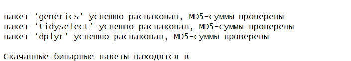

Практическая работа 2
================

## Цель работы

1.  Развить практические навыки использования языка программирования R
    для обработки данных
2.  Закрепить знания базовых типов данных языка R
3.  Развить практические навыки использования функций обработки данных
    пакета dplyr – функции select(), filter(), mutate(), arrange(),
    group_by()

## Исходные данные

1.  ОС Windows
2.  Пакет dplyr
3.  RStudio

## План

1.  Используем RStudio
2.  Скачать пакет dplyr
3.  Проанализировать встроенный в пакет dplyr набор данных starwars с
    помощью языка R
4.  Создать отчет

## Описание шагов:

1.  *Воспользуемся RStudio*

2.  Скачиваем пакет dplyr  
    

3.  Проанализировать встроенный в пакет dplyr набор данных starwars

``` r
library(dplyr)
```

    Warning: пакет 'dplyr' был собран под R версии 4.2.3


    Присоединяю пакет: 'dplyr'

    Следующие объекты скрыты от 'package:stats':

        filter, lag

    Следующие объекты скрыты от 'package:base':

        intersect, setdiff, setequal, union

1.  Сколько строк в датафрейме?

``` r
starwars %>% nrow()
```

    [1] 87

1.  Сколько столбцов в датафрейме?

``` r
starwars %>% ncol()
```

    [1] 14

1.  Как просмотреть примерный вид датафрейма?

``` r
starwars %>% glimpse()
```

    Rows: 87
    Columns: 14
    $ name       <chr> "Luke Skywalker", "C-3PO", "R2-D2", "Darth Vader", "Leia Or…
    $ height     <int> 172, 167, 96, 202, 150, 178, 165, 97, 183, 182, 188, 180, 2…
    $ mass       <dbl> 77.0, 75.0, 32.0, 136.0, 49.0, 120.0, 75.0, 32.0, 84.0, 77.…
    $ hair_color <chr> "blond", NA, NA, "none", "brown", "brown, grey", "brown", N…
    $ skin_color <chr> "fair", "gold", "white, blue", "white", "light", "light", "…
    $ eye_color  <chr> "blue", "yellow", "red", "yellow", "brown", "blue", "blue",…
    $ birth_year <dbl> 19.0, 112.0, 33.0, 41.9, 19.0, 52.0, 47.0, NA, 24.0, 57.0, …
    $ sex        <chr> "male", "none", "none", "male", "female", "male", "female",…
    $ gender     <chr> "masculine", "masculine", "masculine", "masculine", "femini…
    $ homeworld  <chr> "Tatooine", "Tatooine", "Naboo", "Tatooine", "Alderaan", "T…
    $ species    <chr> "Human", "Droid", "Droid", "Human", "Human", "Human", "Huma…
    $ films      <list> <"The Empire Strikes Back", "Revenge of the Sith", "Return…
    $ vehicles   <list> <"Snowspeeder", "Imperial Speeder Bike">, <>, <>, <>, "Imp…
    $ starships  <list> <"X-wing", "Imperial shuttle">, <>, <>, "TIE Advanced x1",…

1.  Сколько уникальных рас персонажей (species) представлено в данных?

``` r
starwars %>% distinct(species)
```

    # A tibble: 38 × 1
       species       
       <chr>         
     1 Human         
     2 Droid         
     3 Wookiee       
     4 Rodian        
     5 Hutt          
     6 Yoda's species
     7 Trandoshan    
     8 Mon Calamari  
     9 Ewok          
    10 Sullustan     
    # ℹ 28 more rows

``` r
length(unique(starwars$species))
```

    [1] 38

1.  Найти самого высокого персонажа

``` r
starwars %>% arrange(desc(height)) %>% slice(1:1) %>% select(name)
```

    # A tibble: 1 × 1
      name       
      <chr>      
    1 Yarael Poof

1.  Найти всех персонажей ниже 170

``` r
starwars %>% filter(height < 170) %>% pull(name)
```

     [1] "C-3PO"                 "R2-D2"                 "Leia Organa"          
     [4] "Beru Whitesun lars"    "R5-D4"                 "Yoda"                 
     [7] "Mon Mothma"            "Wicket Systri Warrick" "Nien Nunb"            
    [10] "Watto"                 "Sebulba"               "Shmi Skywalker"       
    [13] "Dud Bolt"              "Gasgano"               "Ben Quadinaros"       
    [16] "Cordé"                 "Barriss Offee"         "Dormé"                
    [19] "Zam Wesell"            "Jocasta Nu"            "Ratts Tyerell"        
    [22] "R4-P17"                "Padmé Amidala"        

1.  Подсчитать ИМТ (индекс массы тела) для всех персонажей. ИМТ
    подсчитать по формуле 𝐼 = 𝑚/ℎ2 , где 𝑚– масса (weight), а ℎ – рост
    (height).

``` r
starwars %>% mutate("ИМТ" = mass/(height*height)) %>% select(name,ИМТ)
```

    # A tibble: 87 × 2
       name                   ИМТ
       <chr>                <dbl>
     1 Luke Skywalker     0.00260
     2 C-3PO              0.00269
     3 R2-D2              0.00347
     4 Darth Vader        0.00333
     5 Leia Organa        0.00218
     6 Owen Lars          0.00379
     7 Beru Whitesun lars 0.00275
     8 R5-D4              0.00340
     9 Biggs Darklighter  0.00251
    10 Obi-Wan Kenobi     0.00232
    # ℹ 77 more rows

1.  Найти 10 самых “вытянутых” персонажей. “Вытянутость” оценить по
    отношению массы (mass) к росту (height) персонажей.

``` r
starwars %>% mutate("Вытянутость" = mass/height) %>% arrange(desc(Вытянутость)) %>% slice(1:10) %>% select(name,Вытянутость)
```

    # A tibble: 10 × 2
       name                  Вытянутость
       <chr>                       <dbl>
     1 Jabba Desilijic Tiure       7.76 
     2 Grievous                    0.736
     3 IG-88                       0.7  
     4 Owen Lars                   0.674
     5 Darth Vader                 0.673
     6 Jek Tono Porkins            0.611
     7 Bossk                       0.595
     8 Tarfful                     0.581
     9 Dexter Jettster             0.515
    10 Chewbacca                   0.491

9\. Найти средний возраст персонажей каждой расы вселенной Звездных войн

``` r
starwars %>%  group_by(species) %>% filter(!is.na(birth_year)) %>% summarise('Среднее' = mean(birth_year)) %>% select(species, Среднее) 
```

    # A tibble: 16 × 2
       species        Среднее
       <chr>            <dbl>
     1 Cerean            92  
     2 Droid             53.3
     3 Ewok               8  
     4 Gungan            52  
     5 Human             53.4
     6 Hutt             600  
     7 Kel Dor           22  
     8 Mirialan          49  
     9 Mon Calamari      41  
    10 Rodian            44  
    11 Trandoshan        53  
    12 Twi'lek           48  
    13 Wookiee          200  
    14 Yoda's species   896  
    15 Zabrak            54  
    16 <NA>              62  

1.  Найти самый распространенный цвет глаз персонажей вселенной Звездных
    войн.

``` r
starwars %>% filter(!is.na(eye_color)) %>%  group_by(eye_color) %>% summarise('Колличество'= n()) %>% arrange(desc(Колличество)) %>% select(eye_color, Колличество) %>% slice(1)
```

    # A tibble: 1 × 2
      eye_color Колличество
      <chr>           <int>
    1 brown              21

1.  Подсчитать среднюю длину имени в каждой расе вселенной Звездных войн

``` r
starwars %>% mutate(len=nchar(name))  %>% group_by(species) %>% summarise('mean' = mean(len)) %>% select(species,mean)
```

    # A tibble: 38 × 2
       species    mean
       <chr>     <dbl>
     1 Aleena    13   
     2 Besalisk  15   
     3 Cerean    12   
     4 Chagrian  10   
     5 Clawdite  10   
     6 Droid      4.83
     7 Dug        7   
     8 Ewok      21   
     9 Geonosian 17   
    10 Gungan    11.7 
    # ℹ 28 more rows

## Оценка результатов

Задача выполнена при помощи приложения RStudio, удалось развить
практические навыки использования языка R для обработки данных

## Вывод

В данной работе я смог закрепить знания базовых типов данных языка R,
развить практические навыки использования функций обработки данных
пакета dplyr
